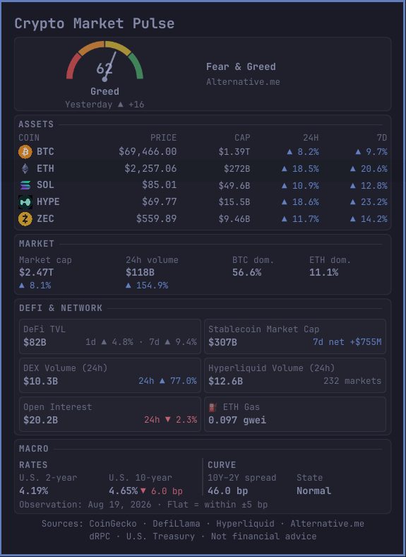

# Crypto Market Pulse

Crypto Market Pulse is a compact, theme-aware Omarchy Quattro bar widget that brings crypto prices, market sentiment, DeFi activity, network conditions, leverage, and U.S. Treasury context into one glanceable panel. It uses public data sources directly, requires no credentials, and keeps unrelated sections available when one provider fails.



## Features

- A compact bar readout for Bitcoin price and 24-hour direction.
- An original Fear & Greed semicircular gauge with the current value, classification, and daily change.
- BTC, ETH, SOL, HYPE, and ZEC prices, market caps, and 24-hour and 7-day changes.
- Global crypto market cap, 24-hour volume, and BTC/ETH dominance.
- DeFi TVL, stablecoin supply and 7-day net issuance, DEX volume, Hyperliquid perpetual-market volume, global open interest, and Ethereum gas.
- U.S. 2-year and 10-year Treasury yields, daily 10-year change, 10Y–2Y spread, and curve state.
- Automatic refresh, independent provider failures, bounded retries, and last-valid-value retention.
- Theme-derived colors with arrows as a stable non-color movement cue.

## Requirements and compatibility

- Omarchy 4 with the Quattro shell plugin system.
- An active network connection for live data.

The widget has no additional runtime dependencies. It does not install packages, services, binaries, or helper programs.

## Installation

Install from the public GitHub repository with the official Omarchy command:

```bash
omarchy plugin add https://github.com/guettoblasterr/omarchy-crypto-pulse.git --enable
```

Omarchy displays its unsandboxed-plugin warning and asks for confirmation before cloning. For a bar widget, it also lets you confirm placement; the manifest defaults to the right section.

If the plugin was added without `--enable`, activate it explicitly:

```bash
omarchy plugin enable io.github.guettoblasterr.crypto-market-pulse --section right
```

## Usage

The bar item shows Bitcoin's compact USD price and its 24-hour direction. Left-click it to open or close the full panel. Escape or clicking outside the panel closes it. Data refreshes automatically; there is no public manual-refresh control.

To disable the widget without removing its files:

```bash
omarchy plugin disable io.github.guettoblasterr.crypto-market-pulse
```

## Updating and removing

Update the Git-managed installation with:

```bash
omarchy plugin update io.github.guettoblasterr.crypto-market-pulse
```

Remove it with:

```bash
omarchy plugin remove io.github.guettoblasterr.crypto-market-pulse
```

Both commands use the official Omarchy plugin manager and ask for confirmation when run interactively. Removal disables the widget before deleting its Git-managed plugin directory; it does not rewrite the rest of the bar layout.

## Refresh and data behavior

Requests begin with a short randomized delay so providers are not hit simultaneously. Each source refreshes independently:

| Data | Target interval |
| --- | ---: |
| CoinGecko asset markets | 2 minutes |
| CoinGecko global market data | 10 minutes |
| Ethereum gas via dRPC | 30 seconds |
| Alternative.me, DefiLlama, and Hyperliquid data | 60 minutes |
| U.S. Treasury yield curve | 6 hours |

Failed requests use bounded exponential backoff capped at two minutes and honor `Retry-After` for HTTP 429 responses. The last valid in-memory value remains visible. A value becomes stale only after more than two complete target intervals without a successful update. Raw responses are parsed and discarded; there is no persistent data cache.

Status language is intentionally compact:

- `Fresh`: every source has current valid data.
- `Partial`: at least one source is missing or retrying while other sections remain usable.
- `Unavailable`: the affected source has not produced a valid value, so only that metric or section is unavailable.
- `Stale`: a retained value is older than twice its source's target refresh interval.

If no source is usable, the panel reports `Offline`. Loading, retry, malformed-response, HTTP, and rate-limit failures never clear valid data from unrelated sources.

## Network sources and attribution

The plugin makes direct HTTPS requests to the following providers:

| Provider | Data used |
| --- | --- |
| [CoinGecko](https://www.coingecko.com/) | Asset prices, market caps, performance, global volume, and dominance |
| [DefiLlama](https://defillama.com/) | DeFi TVL, stablecoin supply, DEX volume, and open interest |
| [Alternative.me](https://alternative.me/crypto/fear-and-greed-index/) | Crypto Fear & Greed Index |
| [Hyperliquid](https://hyperliquid.xyz/) | Perpetual-market 24-hour notional volume and market count |
| [dRPC](https://drpc.org/) | Public Ethereum JSON-RPC gas price |
| [U.S. Treasury](https://home.treasury.gov/resource-center/data-chart-center/interest-rates) | Official 2-year and 10-year daily Treasury yields |

BTC, ETH, SOL, HYPE, and ZEC marks are bundled as fixed local SVG assets from [Web3 Icons](https://github.com/0xa3k5/web3icons) under the MIT License. They are used only to identify their respective assets; the marks remain the property of their respective owners. Exact provenance and license terms are recorded in [`THIRD_PARTY_NOTICES.md`](THIRD_PARTY_NOTICES.md). The plugin never downloads or decodes remote images. The Fear & Greed gauge is original QML Canvas artwork.

## Privacy and permissions

Crypto Market Pulse has no analytics, telemetry, accounts, API keys, credential storage, backend, or user-data collection. It reads no personal files and does not execute shell commands. Network providers will receive the ordinary connection metadata associated with direct HTTPS requests, such as the public IP address and HTTP client metadata.

The plugin runs inside the unsandboxed Omarchy shell process, as all Omarchy shell plugins do. Its code only performs the fixed data requests documented above. No privilege elevation, package manager, installer, background service, downloaded-code execution, or additional executable is used.

## Development and validation

The data normalization and formatting layer is dependency-free JavaScript. Run its tests with Node.js 24 or newer:

```bash
node --test tests/model.test.js
```

Validate the manifest and QML on an Omarchy Quattro system:

```bash
omarchy plugin validate .
/usr/lib/qt6/bin/qmllint -I /usr/share/omarchy/shell \
  BarWidget.qml Panel.qml FearGreedGauge.qml
```

No dependency installation is needed for these checks when using the Node.js, Omarchy, and Qt tools supplied by the development system.

## Troubleshooting

- **The widget is not visible:** run `omarchy plugin enable io.github.guettoblasterr.crypto-market-pulse --section right`.
- **A section says `Unavailable`:** confirm network access and wait for its bounded retry. Other sections should continue working.
- **The panel says `Partial` or `Stale`:** a provider may be rate-limiting, unavailable, or returning an unexpected schema. Retained values remain visible when possible.
- **Changes do not appear after an update:** run `omarchy restart shell` once to force a complete shell reload.
- **Validation fails:** confirm you are using Omarchy 4/Quattro and that `manifest.json` remains in the plugin root.

## Known limitations

- Values depend on public upstream APIs and may be delayed, rate-limited, unavailable, or changed by their providers.
- Data is kept only in memory, so the panel starts empty after the shell restarts and repopulates asynchronously.
- The fixed asset list and USD denomination are not configurable in v1.0.0.
- ETF metrics are intentionally excluded. No stable, documented, reliable public JSON source without credentials met the project's requirements.
- The panel presents market context only. It does not provide alerts, portfolio tracking, trading actions, or a buy/sell score.

## Disclaimer

Crypto Market Pulse is for informational purposes only. It is **not financial advice**. Verify important data independently and make your own financial decisions.

## License

Copyright © 2026 guettoblasterr. Released under the [MIT License](LICENSE).
